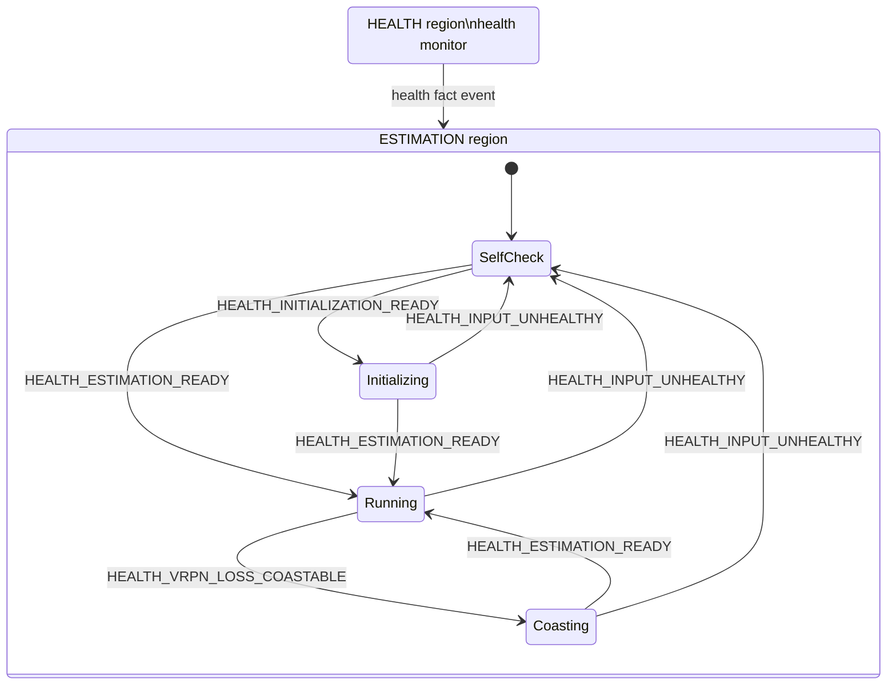
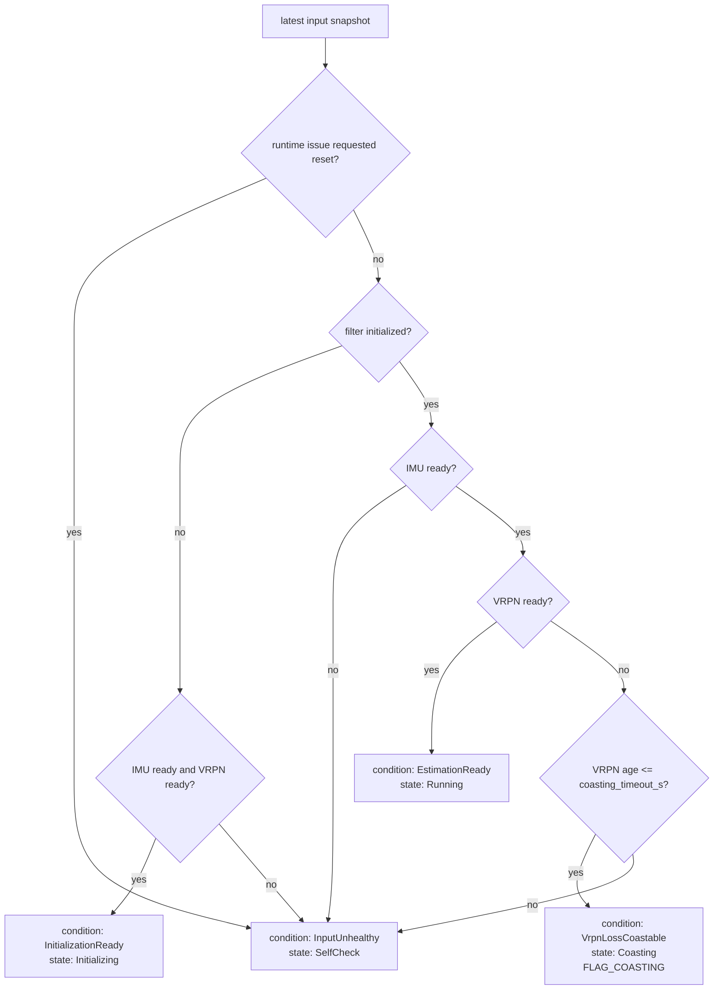

# VRPN PX4 Rotor State Estimator

ROS1 package for estimating full 3D rigid-body state for PX4/MAVROS
multirotor controllers. The package fuses raw MAVROS IMU, VRPN/Gazebo pose,
and optional VRPN/Gazebo twist, then publishes both the controller-facing state
estimate and a corrected vision pose for PX4 external-vision fusion.

The nonlinear estimator is provided by `libxgc2-math-dev` through
`xgc2_math::Pose3InertialEskf`. This package owns the ROS interface, input
event conversion, health classification, state-machine policy, and asynchronous
output publication.

This README focuses on the runtime state model, transition conditions, state
actions, estimator model, and ROS interface.

## State Machine Model

The runtime has two state-machine regions:

- `HEALTH`: evaluates the latest IMU, VRPN pose, filter, and runtime health
  snapshot. It posts an internal health event when the classified health
  condition changes.
- `ESTIMATION`: owns the public estimator state published in
  `RigidStateEstimate.estimator_state`.

Health events are facts produced by the health monitor, not destination-state
commands. The active state inside the `ESTIMATION` region consumes each fact
according to the configured transition table.

The public estimation states use these message values:

| State | Message value |
| --- | ---: |
| `SelfCheck` | `STATE_SELF_CHECK = 1` |
| `Initializing` | `STATE_INITIALIZING = 2` |
| `Running` | `STATE_RUNNING = 3` |
| `Coasting` | `STATE_COASTING = 4` |

`RigidStateEstimate` still defines `STATE_FAULT = 5` for message compatibility,
but this estimator no longer uses `Fault` as an active runtime state. Health or
runtime problems return the estimator to `SelfCheck`.



The transition table is:

| Current estimation state | `HEALTH_INPUT_UNHEALTHY` | `HEALTH_INITIALIZATION_READY` | `HEALTH_ESTIMATION_READY` | `HEALTH_VRPN_LOSS_COASTABLE` |
| --- | --- | --- | --- | --- |
| `SelfCheck` | no transition | `Initializing` | `Running` | no transition |
| `Initializing` | `SelfCheck` | no transition | `Running` | no transition |
| `Running` | `SelfCheck` | no transition | no transition | `Coasting` |
| `Coasting` | `SelfCheck` | no transition | `Running` | no transition |

State-machine update failures request `SelfCheck` output instead of entering a
terminal state. The estimator therefore has no automatic path into public
`STATE_FAULT`.

## Health Classification

The `HEALTH` region recomputes flags on every input event and periodic tick.
The classified health condition is selected from the current input snapshot,
filter initialization status, covariance, and any runtime request to return to
self-check.



Health flags are independent of the selected condition. For example,
`FLAG_EXTRINSIC_UNVERIFIED` is set whenever `extrinsic_verified` is false, but
the estimator can still initialize and run. Downstream controllers can decide
which flags block control.

Classification rules:

| Input fact | Main flags |
| --- | --- |
| IMU or VRPN pose has not been received. | `FLAG_IMU_MISSING`, `FLAG_VRPN_MISSING` |
| IMU or VRPN pose is non-finite or has an invalid quaternion. | `FLAG_INVALID_IMU`, `FLAG_INVALID_VRPN` |
| A sample timestamp moves backward, is non-finite, or the inter-sample gap exceeds `max_time_jump_s`. | `FLAG_TIME_JUMP` |
| A received sample is older than its timeout. | `FLAG_IMU_STALE`, `FLAG_VRPN_STALE` |
| A measured input stream rate is below its minimum. | `FLAG_IMU_RATE_LOW`, `FLAG_VRPN_RATE_LOW` |
| The filter covariance trace exceeds `covariance_high_threshold`. | `FLAG_COVARIANCE_HIGH` |
| Pose fusion rejects a measurement by innovation or time alignment. | `FLAG_INNOVATION_REJECTED`, `FLAG_POSE_TIME_ALIGNMENT_REJECTED` |
| VRPN observation health degrades inside the estimator. | `FLAG_VRPN_SUSPECTED`, `FLAG_VRPN_FAULT`, `FLAG_VRPN_RECOVERY` |
| Filter health degrades inside the estimator. | `FLAG_FILTER_DEGRADED`, `FLAG_FILTER_IMU_ONLY` |
| Extrinsics have not been marked as flight verified. | `FLAG_EXTRINSIC_UNVERIFIED` |

## State Actions

Each estimation state has entry, tick, and exit actions. Only `Running` fuses
VRPN pose and twist. `Coasting` propagates from IMU only during a short VRPN
loss window.

| State | On entry | On input event | On tick | On exit |
| --- | --- | --- | --- | --- |
| `SelfCheck` | Set public state to `SelfCheck`; reset publish gate. | No estimator update. | If health condition remains `InputUnhealthy`, record output and publish state when due. | Reset publish gate. |
| `Initializing` | Set public state to `Initializing`; reset publish gate. | No estimator update. | If health condition remains `InitializationReady`, initialize the ESKF from the latest VRPN pose and IMU sample; publish state when due. | Reset publish gate. |
| `Running` | Set public state to `Running`; reset state and vision publish gates. | IMU propagates inertial state; VRPN pose updates pose; VRPN twist updates velocity. | If health condition remains `EstimationReady`, record `Running` output and publish state and corrected PX4 vision pose when their gates are due. | Reset publish gates. |
| `Coasting` | Set public state to `Coasting`; reset publish gate. | IMU propagates inertial state; VRPN pose and twist are not fused while the health condition is `VrpnLossCoastable`. | Record output with `FLAG_COASTING`; publish state when due. | Reset publish gate. |

## Estimation Model

The estimator state is a full 3D rigid-body state suitable for the PX4
multirotor controller:

- position and velocity in the control world frame,
- body orientation as a unit quaternion,
- body angular velocity,
- body linear acceleration,
- gravity vector and accelerometer bias,
- filter health, VRPN observation health, and pose-fusion diagnostics.

The raw IMU input is converted from `sensor_msgs/Imu`:

| ROS field | Estimator sample field |
| --- | --- |
| `angular_velocity.{x,y,z}` | body angular velocity |
| `linear_acceleration.{x,y,z}` | body specific-force observation |
| `header.stamp` | inertial sample time |

The VRPN pose input is converted from `geometry_msgs/PoseStamped` and fused as
a marker pose measurement. The configured transforms define the relationship
between the VRPN measurement frame, the control world frame, the vehicle body
frame, and the tracked marker frame:

| Parameter group | Meaning |
| --- | --- |
| `field_offset_xyz`, `field_offset_rpy` | `T_WV`, VRPN or measurement frame to control world frame. |
| `imu_to_vrpn_marker_xyz`, `imu_to_vrpn_marker_rpy` | `T_BM`, body or control frame to VRPN marker frame. |

The estimator applies these transforms before publishing the controller-facing
body state. If offline calibration gives `T_MB`, pass its inverse through
`imu_to_vrpn_marker_*`.

Pose updates are gated by position innovation, orientation innovation, and NIS.
Out-of-order pose measurements can be rejected by the estimator history and set
`FLAG_POSE_TIME_ALIGNMENT_REJECTED`. Consecutive accepted or rejected VRPN pose
updates drive the internal VRPN observation health states `Trusted`,
`Suspected`, `Fault`, and `Recovery`.

The optional VRPN twist input is converted from `geometry_msgs/TwistStamped` and
fused as a velocity measurement. It is useful when the simulator or motion
capture bridge provides a differentiated velocity that is less noisy or less
lagged than velocity reconstructed by the inertial filter alone.

The corrected PX4 vision pose is published only when a corrected body pose is
available and no blocking vision flags are set:

```text
FLAG_VRPN_MISSING
FLAG_VRPN_STALE
FLAG_INVALID_VRPN
FLAG_TIME_JUMP
FLAG_POSE_TIME_ALIGNMENT_REJECTED
FLAG_VRPN_FAULT
FLAG_FILTER_IMU_ONLY
```

## Topics and Parameters

Default topics:

| Direction | Topic | Type | Used field |
| --- | --- | --- | --- |
| Subscribe | `mavros/imu/data_raw` | `sensor_msgs/Imu` | angular velocity, linear acceleration |
| Subscribe | `/vrpn_client_node/uav1/pose` | `geometry_msgs/PoseStamped` | position, orientation |
| Subscribe | `/vrpn_client_node/uav1/twist` | `geometry_msgs/TwistStamped` | `twist.linear` |
| Publish | `alg/state_estimator/state` | `rigid_state_estimator_msgs/RigidStateEstimate` | full controller state and diagnostics |
| Publish | `mavros/vision_pose/pose` | `geometry_msgs/PoseStamped` | corrected body pose for PX4 vision input |

When launched under `ns:=uav1`, relative topics are resolved below `/uav1`.
The default VRPN topics are absolute, so they are not remapped by the namespace
unless the config file is changed.

Default parameters:

| Parameter | Default | Meaning |
| --- | ---: | --- |
| `imu_topic` | `mavros/imu/data_raw` | Raw MAVROS IMU input topic. |
| `vrpn_pose_topic` | `/vrpn_client_node/uav1/pose` | VRPN or Gazebo pose input topic. |
| `vrpn_twist_topic` | `/vrpn_client_node/uav1/twist` | Optional VRPN or Gazebo twist input topic. Empty disables the subscriber. |
| `state_topic` | `alg/state_estimator/state` | Controller-facing state estimate output topic. |
| `vision_pose_topic` | `mavros/vision_pose/pose` | PX4 vision pose output topic. |
| `loop_rate_hz` | `1000.0` | Main runtime update loop rate. Clamped to at most 2000 Hz. |
| `state_publish_rate_hz` | `100.0` | State estimate publish rate. |
| `vision_publish_rate_hz` | `30.0` | Corrected PX4 vision pose publish rate. |
| `gravity_mps2` | `9.8066` | Gravity magnitude used by the ESKF. |
| `field_offset_xyz` | `[0.0, 0.0, 0.0]` | Translation of `T_WV`. |
| `field_offset_rpy` | `[0.0, 0.0, 0.0]` | Roll, pitch, yaw of `T_WV`. |
| `imu_to_vrpn_marker_xyz` | `[0.0, 0.0, 0.0]` | Translation of `T_BM`. |
| `imu_to_vrpn_marker_rpy` | `[0.0, 0.0, 0.0]` | Roll, pitch, yaw of `T_BM`. |
| `extrinsic_verified` | `false` | Publishes `FLAG_EXTRINSIC_UNVERIFIED` until calibration is marked flight verified. |
| `estimate_extrinsic` | `false` | Enables estimator-side extrinsic random walk. Keep false for normal flight. |
| `imu_timeout_s` | `0.05` | Maximum IMU sample age before `FLAG_IMU_STALE`. |
| `vrpn_timeout_s` | `0.12` | Maximum VRPN pose sample age before `FLAG_VRPN_STALE`. |
| `coasting_timeout_s` | `0.5` | Maximum initialized VRPN-loss window before returning to `SelfCheck`. |
| `min_imu_rate_hz` | `25.0` | Minimum healthy IMU input rate. |
| `min_vrpn_rate_hz` | `20.0` | Minimum healthy VRPN pose input rate. |
| `max_time_jump_s` | `0.25` | Maximum allowed inter-sample gap before `FLAG_TIME_JUMP`. |
| `imu_noise_std_is_density` | `false` | Treat accel/gyro noise stds as continuous-time densities. UGV config enables this; flight keeps legacy per-sample tuning. |
| `accel_noise_std` | `0.35` | Accelerometer process noise standard deviation. |
| `gyro_noise_std` | `0.03` | Gyroscope process noise standard deviation. |
| `vrpn_position_noise_std` | `0.01` | VRPN position measurement noise standard deviation. |
| `vrpn_orientation_noise_std` | `0.01` | VRPN orientation measurement noise standard deviation. |
| `vrpn_velocity_noise_std` | `0.05` | VRPN velocity measurement noise standard deviation. |
| `gyro_bias_random_walk_std` | `0.0001` | Gyro bias random-walk standard deviation. |
| `accel_bias_random_walk_std` | `0.001` | Accelerometer bias random-walk standard deviation. |
| `extrinsic_position_random_walk_std` | `0.00001` | Extrinsic translation random-walk standard deviation. |
| `extrinsic_orientation_random_walk_std` | `0.00001` | Extrinsic orientation random-walk standard deviation. |
| `innovation_position_gate_m` | `1.5` | Consecutive raw VRPN jump reject (ID hop / flyer). Not filter lag. |
| `innovation_orientation_gate_rad` | `0.8` | Consecutive raw VRPN orientation jump reject. |
| `apply_pose_covariance_floor` | `true` | Restore pose covariance after an accepted update. Disable only with replay evidence. |
| `pose_position_kalman_gain` | `0.9` | After a trusted pose, keep \(K_p \approx 0.9\). Accepted VRPN always fused. |
| `pose_orientation_kalman_gain` | `0.8` | Same for orientation. |
| `pose_update_iterations` | `3` | IESKF pose updates (relinearize \(H\)). `1` is a single ESKF step. |
| `pose_update_convergence` | `1e-5` | Stop IESKF early when \(\|\delta p,\delta\theta\|\) is below this. |
| `velocity_innovation_gate_mps` | `3.0` | Velocity innovation rejection gate. |
| `pose_nis_gate` | `22.5` | Pose normalized innovation squared rejection gate. |
| `covariance_high_threshold` | `100.0` | Covariance trace threshold for `FLAG_COVARIANCE_HIGH`. |
| `max_propagation_dt_s` | `0.01` | Maximum inertial propagation step inside the ESKF. |
| `inertial_buffer_capacity` | `128` | Inertial history capacity used for pose time alignment. |
| `initial_position_variance` | `0.01` | Initial position covariance. |
| `initial_velocity_variance` | `0.1` | Initial velocity covariance. |
| `initial_orientation_variance` | `0.01` | Initial orientation covariance. |
| `initial_gyro_bias_variance` | `0.01` | Initial gyro bias covariance. |
| `initial_accel_bias_variance` | `0.1` | Initial accelerometer bias covariance. |

## Launch

Install from the binary package when available:

```bash
sudo apt update
sudo apt install ros-noetic-xgc2-estimator-rigid-state
```

Launch the estimator for one UAV namespace:

```bash
source /opt/ros/noetic/setup.bash
roslaunch estimator_vrpn_px4_rotor_state vrpn_px4_rotor_state_estimator.launch ns:=uav1
```

Parameters are loaded from
`config/vrpn_px4_rotor_state_estimator.yaml` under the node namespace
`/<ns>/vrpn_px4_rotor_state_estimator`.

The launch file also starts `request_highres_imu_rate.py` by default:

```text
request_highres_imu:=true
highres_imu_message_id:=105
highres_imu_rate:=250.0
highres_imu_reassert_period:=10.0
```

That helper waits for `/<ns>/mavros/state` to report a MAVROS connection, then
calls `/<ns>/mavros/set_message_interval` to request MAVLink `HIGHRES_IMU`
telemetry at the configured rate. This keeps raw IMU telemetry ownership close
to the state-estimation consumer.

## Runtime Notes

For flight, calibrate `field_offset_*` and `imu_to_vrpn_marker_*`, then set
`extrinsic_verified: true`. With the default `false`, the estimator still runs
but publishes `FLAG_EXTRINSIC_UNVERIFIED`; the PX4 multirotor controller treats
that flag as blocking for control.

Use the Gazebo config file for simulation-only runs where the identity
extrinsic is already known:

```bash
roslaunch estimator_vrpn_px4_rotor_state vrpn_px4_rotor_state_estimator.launch \
  ns:=uav1 \
  config_file:=$(rospack find estimator_vrpn_px4_rotor_state)/config/vrpn_px4_rotor_state_estimator_gazebo.yaml
```
