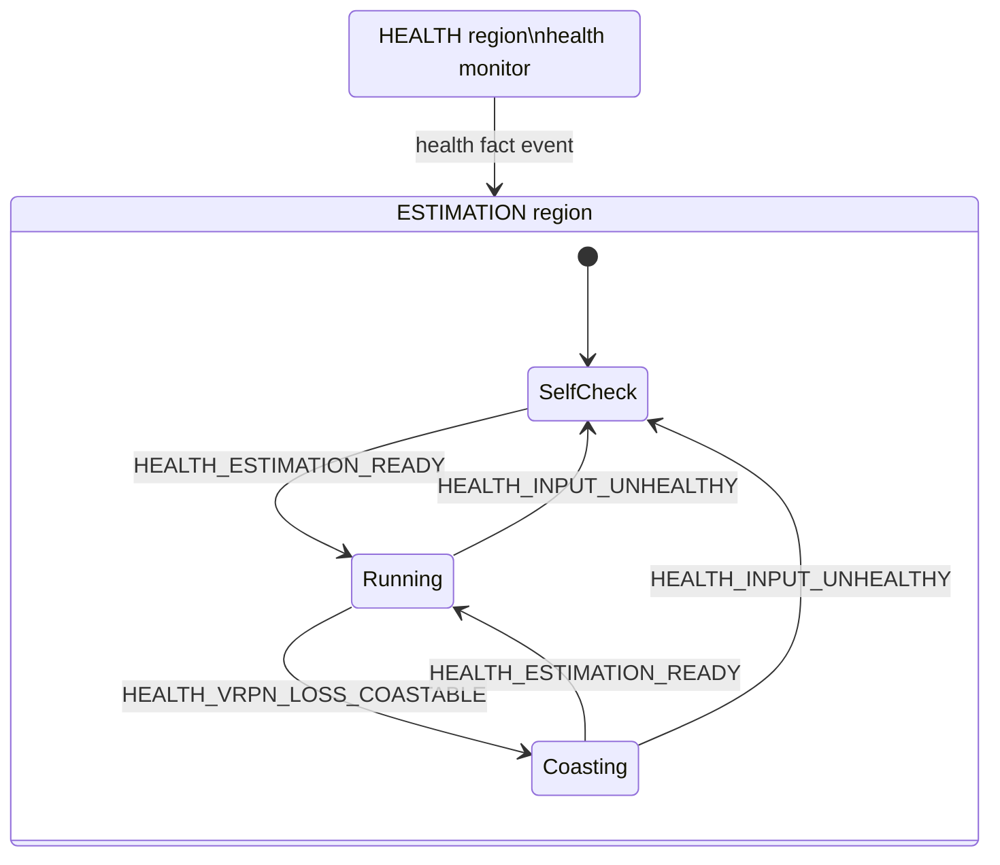
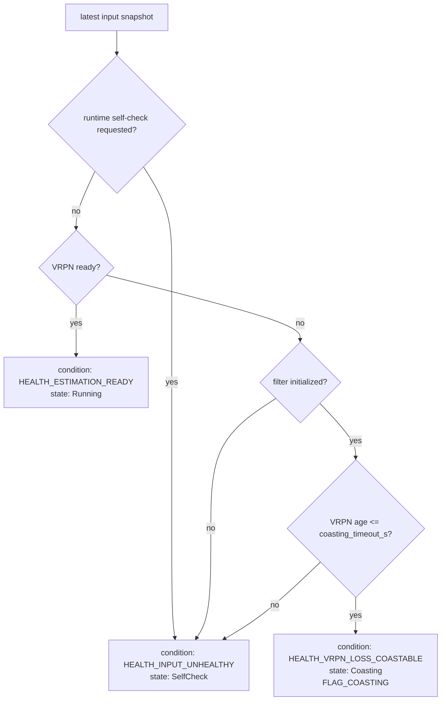

# VRPN UGV State Estimator

ROS1 package for estimating planar rigid-body state for XGC2 UGV controllers.
The package fuses VRPN/Gazebo pose with optional raw IMU propagation, then
publishes a controller-facing planar state estimate.

The nonlinear estimator is provided by `libxgc2-math-dev` through
`xgc2_math::Pose2InertialEskf`. This package owns the ROS interface, input
event conversion, health classification, state-machine policy, and asynchronous
output publication.

This README focuses on the runtime state model, transition conditions, state
actions, estimator model, and ROS interface.

## State Machine Model

The runtime has two state-machine regions:

- `HEALTH`: evaluates the latest VRPN pose, IMU, filter, and runtime health
  snapshot. It posts internal health events when the classified health
  condition changes.
- `ESTIMATION`: owns the public estimator state published in
  `PlanarStateEstimate.estimator_state`.

The UGV estimator treats VRPN pose as the primary measurement. IMU samples are
used for inertial propagation when present, but a ready VRPN pose can move the
estimator into `Running` even before a valid IMU sample has arrived.

Health events are facts about the estimator input and filter health, not names
of target states. The active runtime states are:

| State | Message value |
| --- | ---: |
| `SelfCheck` | `STATE_SELF_CHECK = 1` |
| `Running` | `STATE_RUNNING = 2` |
| `Coasting` | `STATE_COASTING = 3` |

`PlanarStateEstimate` still defines `STATE_FAULT = 4` for message compatibility,
but this runtime does not use `Fault` as an active state. If health becomes
unusable, the estimator returns to `SelfCheck`.



The transition table is:

| Current estimation state | `HEALTH_INPUT_UNHEALTHY` | `HEALTH_ESTIMATION_READY` | `HEALTH_VRPN_LOSS_COASTABLE` |
| --- | --- | --- | --- |
| `SelfCheck` | no transition | `Running` | no transition |
| `Running` | `SelfCheck` | no transition | `Coasting` |
| `Coasting` | `SelfCheck` | `Running` | no transition |

State-machine construction, transition, or update failures are treated as a
request to re-enter `SelfCheck` instead of continuing with an undefined update.

## Health Classification

The `HEALTH` region recomputes flags on every input event and periodic tick.
The classified health condition is selected from the current input snapshot,
filter initialization status, covariance, and any runtime self-check request.



Health flags are independent of the selected state. For example, IMU missing or
stale flags are still published, but VRPN-ready input can keep the UGV estimator
in `Running`.

Classification rules:

| Input fact | Main flags |
| --- | --- |
| IMU or VRPN pose has not been received. | `FLAG_IMU_MISSING`, `FLAG_VRPN_MISSING` |
| IMU or VRPN pose is non-finite or has an invalid yaw quaternion. | `FLAG_INVALID_IMU`, `FLAG_INVALID_VRPN` |
| A sample timestamp moves backward, is non-finite, or the inter-sample gap exceeds `max_time_jump_s`. | `FLAG_TIME_JUMP` |
| A received sample is older than its timeout. | `FLAG_IMU_STALE`, `FLAG_VRPN_STALE` |
| A measured input stream rate is below its minimum. | `FLAG_IMU_RATE_LOW`, `FLAG_VRPN_RATE_LOW` |
| The filter covariance trace exceeds `covariance_high_threshold`. | `FLAG_COVARIANCE_HIGH` |
| Pose fusion rejects a measurement by innovation or time alignment. | `FLAG_INNOVATION_REJECTED`, `FLAG_POSE_TIME_ALIGNMENT_REJECTED` |
| VRPN observation health degrades inside the estimator. | `FLAG_VRPN_SUSPECTED`, `FLAG_VRPN_FAULT`, `FLAG_VRPN_RECOVERY` |
| Filter health degrades inside the estimator. | `FLAG_FILTER_DEGRADED`, `FLAG_FILTER_IMU_ONLY` |
| Extrinsics have not been marked as verified. | `FLAG_EXTRINSIC_UNVERIFIED` |

The VRPN observation states `Trusted`, `Suspected`, `Fault`, and `Recovery` are
estimator diagnostics from `xgc2_math`; they are not runtime state-machine
states.

## State Actions

Each estimation state has entry, tick, and exit actions. `Running` fuses VRPN
pose and uses IMU for propagation. `Coasting` propagates from IMU only during a
short VRPN loss window.

| State | On entry | On input event | On tick | On exit |
| --- | --- | --- | --- | --- |
| `SelfCheck` | Set public state to `SelfCheck`; reset publish gate. | No estimator update. | If health condition remains `HEALTH_INPUT_UNHEALTHY`, record output and publish state when due. | Reset publish gate. |
| `Running` | Set public state to `Running`; reset publish gate; initialize from latest VRPN pose if needed. | IMU propagates planar inertial state; VRPN pose initializes or updates pose. | Record `Running` output and publish `PlanarStateEstimate` when due. | Reset publish gate. |
| `Coasting` | Set public state to `Coasting`; reset publish gate. | IMU propagates planar inertial state; VRPN pose is not fused while the health condition is coasting. | Record output with `FLAG_COASTING`; publish state when due. | Reset publish gate. |

## Estimation Model

The estimator state is a planar rigid-body state suitable for UGV control:

- planar position in the control world frame,
- planar velocity,
- yaw and yaw rate,
- filter health, VRPN observation health, and pose-fusion diagnostics.

The raw IMU input is converted from `sensor_msgs/Imu`:

| ROS field | Estimator sample field |
| --- | --- |
| `angular_velocity.z` | yaw rate input |
| `linear_acceleration.{x,y}` | planar body acceleration input |
| `header.stamp` | inertial sample time |

The VRPN pose input is converted from `geometry_msgs/PoseStamped`. Only
`pose.position.x`, `pose.position.y`, and yaw extracted from `pose.orientation`
are used. Roll, pitch, and z position are ignored by the planar estimator.

The configured transforms define the relationship between the VRPN measurement
frame, the control world frame, the vehicle body frame, and the tracked marker
frame:

| Parameter group | Meaning |
| --- | --- |
| `field_offset_xyz`, `field_offset_rpy` | `T_WV`, VRPN or measurement frame to control world frame. Only x, y, and yaw are used. |
| `body_to_vrpn_marker_xyz`, `body_to_vrpn_marker_rpy` | `T_BM`, body frame to VRPN marker frame. Only x, y, and yaw are used. |

The estimator applies these transforms before publishing the controller-facing
body state. Extrinsic estimation is disabled in this package; provide calibrated
extrinsics through the config file and set `extrinsic_verified: true` after they
are verified.

Pose updates are gated by position innovation and yaw innovation. Out-of-order
pose measurements can be rejected by the estimator history and set
`FLAG_POSE_TIME_ALIGNMENT_REJECTED`. Consecutive accepted or rejected VRPN pose
updates drive the internal VRPN observation health states `Trusted`,
`Suspected`, `Fault`, and `Recovery`.

## Topics and Parameters

Default topics:

| Direction | Topic | Type | Used field |
| --- | --- | --- | --- |
| Subscribe | `mavros/imu/data_raw` | `sensor_msgs/Imu` | `angular_velocity.z`, `linear_acceleration.x/y` |
| Subscribe | `/vrpn_client_node/ugv1/pose` | `geometry_msgs/PoseStamped` | x, y, yaw |
| Publish | `alg/state_estimator/state` | `rigid_state_estimator_msgs/PlanarStateEstimate` | planar controller state and diagnostics |

When launched under `ns:=ugv1`, relative topics are resolved below `/ugv1`.
The default VRPN topic is absolute, so it is not remapped by the namespace
unless the config file is changed.

Default parameters:

| Parameter | Default | Meaning |
| --- | ---: | --- |
| `imu_topic` | `mavros/imu/data_raw` | Raw MAVROS IMU input topic. |
| `vrpn_pose_topic` | `/vrpn_client_node/ugv1/pose` | VRPN or Gazebo pose input topic. |
| `state_topic` | `alg/state_estimator/state` | Controller-facing planar state output topic. |
| `loop_rate_hz` | `1000.0` | Main runtime update loop rate. Clamped to at most 2000 Hz. |
| `state_publish_rate_hz` | `100.0` | Planar state estimate publish rate. |
| `field_offset_xyz` | `[0.0, 0.0, 0.0]` | Translation of `T_WV`; z is ignored. |
| `field_offset_rpy` | `[0.0, 0.0, 0.0]` | Roll, pitch, yaw of `T_WV`; only yaw is used. |
| `body_to_vrpn_marker_xyz` | `[0.0, 0.0, 0.0]` | Translation of `T_BM`; z is ignored. |
| `body_to_vrpn_marker_rpy` | `[0.0, 0.0, 0.0]` | Roll, pitch, yaw of `T_BM`; only yaw is used. |
| `extrinsic_verified` | `false` | Publishes `FLAG_EXTRINSIC_UNVERIFIED` until calibration is marked verified. |
| `imu_timeout_s` | `0.2` | Maximum IMU sample age before `FLAG_IMU_STALE`. |
| `vrpn_timeout_s` | `0.12` | Maximum VRPN pose sample age before `FLAG_VRPN_STALE`. |
| `coasting_timeout_s` | `0.5` | Maximum initialized VRPN-loss window before returning to `SelfCheck`. |
| `min_imu_rate_hz` | `5.0` | Minimum healthy IMU input rate. |
| `min_vrpn_rate_hz` | `20.0` | Minimum healthy VRPN pose input rate. |
| `max_time_jump_s` | `0.25` | Maximum allowed inter-sample gap before `FLAG_TIME_JUMP`. |
| `gyro_noise_std` | `0.03` | Gyro process noise standard deviation. |
| `accel_noise_std` | `0.35` | Planar accelerometer process noise standard deviation. |
| `gyro_bias_random_walk_std` | `0.0001` | Gyro bias random-walk standard deviation. |
| `accel_bias_random_walk_std` | `0.001` | Accelerometer bias random-walk standard deviation. |
| `vrpn_position_noise_std` | `0.01` | VRPN planar position measurement noise standard deviation. |
| `vrpn_yaw_noise_std` | `0.01` | VRPN yaw measurement noise standard deviation. |
| `innovation_position_gate_m` | `1.5` | Position innovation rejection gate. |
| `innovation_yaw_gate_rad` | `0.8` | Yaw innovation rejection gate. |
| `covariance_high_threshold` | `100.0` | Covariance trace threshold for `FLAG_COVARIANCE_HIGH`. |

## Launch

Install from the binary package when available:

```bash
sudo apt update
sudo apt install ros-noetic-xgc2-estimator-rigid-state
```

Launch the estimator for one UGV namespace:

```bash
source /opt/ros/noetic/setup.bash
roslaunch estimator_vrpn_ugv_state vrpn_ugv_state_estimator.launch ns:=ugv1
```

Parameters are loaded from `config/vrpn_ugv_state_estimator.yaml` under the node
namespace `/<ns>/vrpn_ugv_state_estimator`.

## Runtime Notes

For real robot runs, calibrate `field_offset_*` and
`body_to_vrpn_marker_*`, then set `extrinsic_verified: true`. With the default
`false`, the estimator still runs but publishes `FLAG_EXTRINSIC_UNVERIFIED`.

The package publishes only `PlanarStateEstimate`. It does not publish PX4
vision pose and does not request MAVLink message rates.
